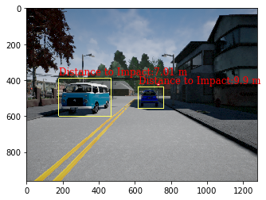

# Environment Perception For Self-Driving Cars

In this project, you will learn how to use neural networks to extract critical information from a driving scene. This work is essential for enabling autonomous vehicles to navigate their environment safely and reliably.

## Objectives

In this project, we will:

1. **3D Driving Space Estimation**  
   Use the output from semantic segmentation neural networks to estimate the drivable space where the car can safely navigate.

2. **Lane Estimation**  
   Utilize semantic segmentation results to determine lanes and guide the vehicle accordingly.

3. **Filtering 2D Object Detection Errors**  
   Use semantic segmentation results to filter out errors in the 2D object detectors' outputs, improving detection reliability.

4. **Obstacle Distance Estimation**  
   From the filtered 2D object detection results, calculate the distance between obstacles and the autonomous vehicle.

## Prerequisites

Before you begin, you should have the following:

- Knowledge of convolutional neural networks (CNNs) and semantic segmentation.
- Familiarity with computer vision concepts.
- Required libraries: TensorFlow, OpenCV, NumPy, Matplotlib.

## Results

- The estimated driving space.
- Lane detection.
- Detected obstacles and their distance from the vehicle.

## Visualize Results

- Original Image
.

- Ground Mask
 .

- Final Lanes
 . 

- Distance to Impact
 .

## Contributing

Feel free to fork this project, submit issues, and create pull requests. Contributions are welcome!

